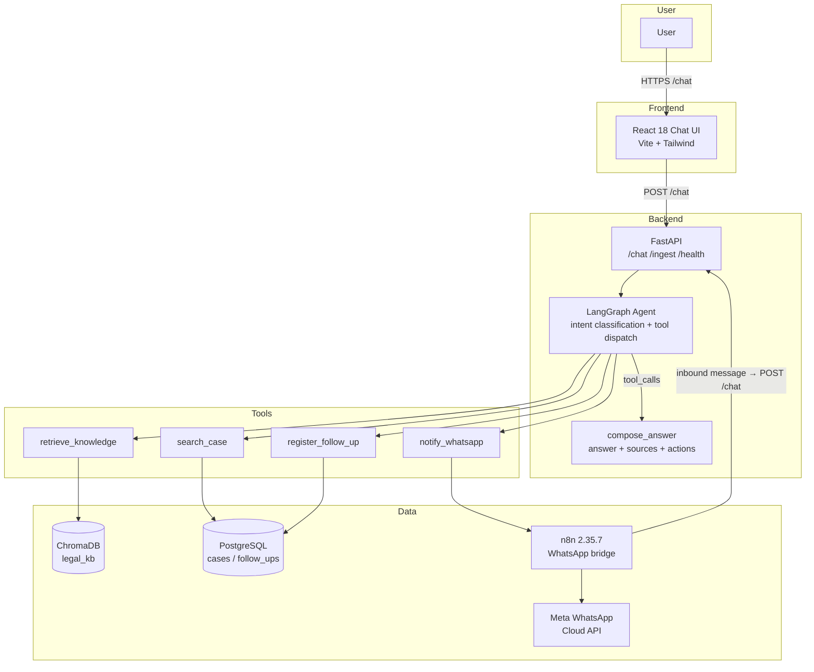

# LexBot

**Legal assistant with RAG and agentic AI** — a portfolio project for a legal-firm internship. Chat with a firm's knowledge base, search case records, and register follow-ups, all grounded in retrieved documents.

## Architecture Overview



## Components

| Component | Technology | Purpose |
|---|---|---|
| `ingest/` | Python package | Chunk → embed → store pipeline; CLI for knowledge ingestion |
| `agent/` | LangGraph ≥ 0.2 | Intent classification, 4 tools, answer composition with citations |
| `api/` | FastAPI + uvicorn | `POST /chat`, `POST /ingest`, `GET /health`; CORS for the UI |
| `ui/` | React 18 + Vite + Tailwind | Chat interface with sources, actions, error/retry UX |
| `db/` | PostgreSQL 15 + pgvector | Idempotent `cases` / `follow_ups` schema |
| `n8n/` | n8n 2.35.7 workflows | Pure WhatsApp bridge (inbound + outbound) |

## Technology Stack

| Layer | Technology |
|---|---|
| Language | Python 3.11+ / TypeScript |
| Agent framework | LangGraph ≥ 0.2, langchain-core ≥ 0.3 |
| LLMs | Google Gemini (`gemini-3.6-flash`, `gemini-embedding-001`), OpenAI fallback |
| Embeddings | OpenAI, Google Gemini, built-in Fake (keyless dev fallback) |
| Vector store | ChromaDB ≥ 0.5 (persistent client, cosine) |
| API | FastAPI, uvicorn, pydantic |
| Frontend | React 18, Vite 8, Tailwind CSS 4, vitest + Testing Library |
| Database | PostgreSQL 15 + pgvector (Docker Compose), psycopg 3 |
| Orchestration | n8n (WhatsApp bridge), Docker Compose |
| Tests | pytest (49), vitest (30) |

## Project Structure

```
lexbot/
├── ingest/                       # Ingestion pipeline (Milestone 1)
│   ├── src/lexbot_ingest/
│   │   ├── chunker.py            # Chunk dataclass + overlapping windows
│   │   ├── embeddings.py         # Embedder ABC + Fake/OpenAI/Gemini
│   │   ├── vector_store.py       # ChromaDB wrapper (legal_kb, cosine)
│   │   └── cli.py                # argparse CLI + load_dotenv()
│   └── tests/                    # 13 tests
├── agent/                        # LangGraph agent (Milestone 2)
│   └── src/lexbot_agent/
│       ├── state.py              # AgentState (messages, intent, sources)
│       ├── llm.py                # build_llm() factory + FakeLLM
│       ├── tools.py              # 4 tools: retrieve/search/follow_up/notify
│       └── graph.py              # StateGraph: classify → tools → compose
├── api/                          # FastAPI surface (Milestone 2)
│   └── src/lexbot_api/           # app factory, routers, schemas, Dockerfile
├── ui/                           # React chat UI (Milestone 3)
│   └── src/
│       ├── api/                  # typed client (types mirror schemas.py)
│       ├── hooks/                # useChat (useReducer), useHealth
│       └── components/           # ChatWindow, MessageBubble, SourceCard...
├── n8n/                          # WhatsApp bridge workflows (Milestone 4)
│   ├── outbound-whatsapp.json    # notify webhook → Meta send
│   └── inbound-whatsapp.json     # Meta webhook → /chat → reply
├── db/init.sql                   # Idempotent cases + follow_ups DDL
├── docs/knowledge/               # Seed docs (policies, FAQ, glossary)
└── docker-compose.yml            # db + api + n8n services
```

## Key Features

- **Grounded answers** — every knowledge answer cites its source documents with distance metadata
- **4 agent tools** — knowledge retrieval (ChromaDB), case search (PostgreSQL), follow-up registration, WhatsApp notify (webhook stub or real n8n bridge)
- **Keyless dev posture** — missing API keys fall back to FakeEmbedder/FakeLLM with a startup warning; the stack boots and answers deterministically without credentials
- **Hermetic tests** — 79 tests across four suites, no network required (fetch and LLM mocked at boundaries)
- **WhatsApp channel** — Meta Cloud API via n8n as a pure bridge; zero agent/API code changes to enable it

## Architecture Decisions

| Decision | Why |
|---|---|
| ChromaDB persistent client for dev | Zero-infra local store; pgvector is the documented production path (Milestone 5) |
| Explicit embeddings passed to ChromaDB | Avoids the default embedding function and its onnxruntime dependency |
| `--reset` as the idempotent re-ingest path | Re-running without it raises duplicate-ID errors; reset before switching providers (fixed collection dimensionality) |
| LangGraph ToolNode + langchain-core 0.3 | Intent classification **is** tool selection; no tool_calls means graceful decline. Pinned `langgraph>=0.2,<0.3` to avoid API drift |
| `build_llm()`/`build_embedder()` factories with env fallback | One provider chain (arg → env → default); unknown provider raises `ValueError` |
| n8n as pure WhatsApp bridge | Keeps WhatsApp logic out of the agent/API; workflows are JSON exports with `{{ $env.WHATSAPP_* }}` credentials only |
| `env_file: .env` on the api service | Credentials reach the container without committing them; `required: false` keeps fresh clones working |
| FakeLLM fallback on missing key | Deterministic decline path lets the whole graph run offline; a real key unlocks live LLM answers |

## Prerequisites

- Python 3.11+
- Node.js `^20.19.0 || >=22.12.0` (Vite 8 engine floor)
- Docker (API + PostgreSQL + n8n)
- (Optional) Gemini or OpenAI API key for real LLM answers
- (Optional) Meta WhatsApp Cloud API app + test number for the WhatsApp channel

## Quick Start

> **Note**: Without API keys the stack boots in keyless mode — the bot answers with deterministic fallbacks. Add `GEMINI_API_KEY` to `.env` for real answers with citations.

### 1. API + database

```bash
cp .env.example .env        # add GEMINI_API_KEY (and WHATSAPP_* for M4)
docker compose up -d --build
curl localhost:8000/health  # {"status":"ok","vector_count":7,"db":"ok"}
```

### 2. Chat UI

```bash
cd ui && npm install && npm run dev   # http://localhost:5173
```

The UI calls `VITE_API_URL` (default `http://localhost:8000`); the API allows `CORS_ORIGINS` (default `http://localhost:5173`).

### 3. Chat from the terminal

```bash
curl -X POST localhost:8000/chat \
  -H "Content-Type: application/json" \
  -d '{"message":"What are the confidentiality rules?"}'
```

### 4. Re-seed the knowledge base (after switching providers)

```bash
cd ingest && .venv/bin/python -m lexbot_ingest.cli \
  --docs ../docs/knowledge --db-path ../data/chroma \
  --provider gemini --reset
docker compose restart api   # reconnect the API to the re-seeded store
```

## Running Tests

```bash
cd ingest && python -m pytest tests/ -v    # 13 tests
cd agent  && python -m pytest tests/ -v    # 26 tests
cd api    && python -m pytest tests/ -v    # 10 tests
cd ui     && npm test                      # 30 tests
```

## Troubleshooting

| Symptom | Cause | Fix |
|---|---|---|
| `/chat` hangs for minutes then 503 | Deprecated Gemini model (e.g. `gemini-2.0-flash` was retired) | Set `LLM_MODEL` to a current model (default is now `gemini-3.6-flash`); rebuild with `docker compose up -d --build api` |
| `docker compose` commands hang | Host disk full — the daemon cannot write | `df -h`; free space (npm cache, trash) and restart Docker Desktop |
| `/health` shows `vector_count: -1` | API holds a stale ChromaDB collection handle after an external reset | `docker compose restart api` |
| `db` fails to bind 5432 | Another project's PostgreSQL occupies the port | Stop that container, or map `5433:5432` for local runs |
| API answers without citations after adding a key | Store was seeded with FakeEmbedder vectors | Re-seed with the real provider + `--reset`, then restart api (see Quick Start 4) |
| WhatsApp sends fail with non-2xx | `WHATSAPP_*` credentials missing | Set them in `.env`; test numbers only reach verified recipients |

## Roadmap

- [x] **Milestone 1** — Scaffold + ingestion pipeline
- [x] **Milestone 2** — Agent + API (LangGraph, FastAPI)
- [x] **Milestone 3** — Web UI (React 18 + Vite)
- [x] **Milestone 4** — n8n + WhatsApp integration
- [ ] **Milestone 5** — Production deployment (AWS CDK)

## License

MIT

---

Built with [LangGraph](https://www.langchain.com/langgraph), [FastAPI](https://fastapi.tiangolo.com), [React](https://react.dev), [ChromaDB](https://www.trychroma.com), [n8n](https://n8n.io) and [AWS CDK](https://aws.amazon.com/cdk/).