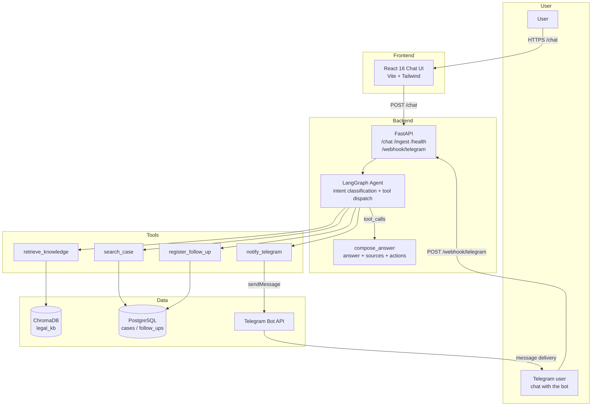

# LexBot

**Legal assistant with RAG and agentic AI** — Chat with a firm's knowledge base, search case records, and register follow-ups, all grounded in retrieved documents.

## Architecture Overview



## Components

| Component | Technology | Purpose |
|---|---|---|
| `ingest/` | Python package | Chunk → embed → store pipeline; CLI for knowledge ingestion |
| `agent/` | LangGraph ≥ 0.2 | Intent classification, 4 tools, answer composition with citations |
| `api/` | FastAPI + uvicorn | `POST /chat`, `POST /ingest`, `GET /health`, `POST /webhook/telegram`; CORS for the UI |
| `ui/` | React 18 + Vite + Tailwind | Chat interface with sources, actions, error/retry UX |
| `db/` | PostgreSQL 15 + pgvector | Idempotent `cases` / `follow_ups` schema |

## Technology Stack

| Layer | Technology |
|---|---|
| Language | Python 3.11+ / TypeScript |
| Agent framework | LangGraph ≥ 0.2, langchain-core ≥ 0.3 |
| LLMs | Google Gemini (`gemini-3.6-flash`, `gemini-embedding-001`), OpenAI fallback |
| Embeddings | OpenAI, Google Gemini, built-in Fake (keyless dev fallback) |
| Vector store | ChromaDB ≥ 0.5 (persistent client, cosine) |
| API | FastAPI, uvicorn, pydantic |
| Frontend | React 18, Vite 8, Tailwind CSS 4, vitest + Testing Library |
| Database | PostgreSQL 15 + pgvector (Docker Compose), psycopg 3 |
| Orchestration | Docker Compose |
| Tests | pytest (66), vitest (30) |

## Project Structure

```
lexbot/
├── ingest/                       # Ingestion pipeline (Milestone 1)
│   ├── src/lexbot_ingest/
│   │   ├── chunker.py            # Chunk dataclass + overlapping windows
│   │   ├── embeddings.py         # Embedder ABC + Fake/OpenAI/Gemini
│   │   ├── vector_store.py       # ChromaDB wrapper (legal_kb, cosine)
│   │   └── cli.py                # argparse CLI + load_dotenv()
│   └── tests/                    # 13 tests
├── agent/                        # LangGraph agent (Milestone 2)
│   └── src/lexbot_agent/
│       ├── state.py              # AgentState (messages, intent, sources)
│       ├── llm.py                # build_llm() factory + FakeLLM
│       ├── tools.py              # 4 tools: retrieve/search/follow_up/notify
│       └── graph.py              # StateGraph: classify → tools → compose
├── api/                          # FastAPI surface (Milestone 2)
│   └── src/lexbot_api/           # app factory, routers, schemas, Dockerfile
├── ui/                           # React chat UI (Milestone 3)
│   └── src/
│       ├── api/                  # typed client (types mirror schemas.py)
│       ├── hooks/                # useChat (useReducer), useHealth
│       └── components/           # ChatWindow, MessageBubble, SourceCard...
├── db/init.sql                   # Idempotent cases + follow_ups DDL
├── docs/knowledge/               # Seed docs (policies, FAQ, glossary)
└── docker-compose.yml            # db + api services
```

## Key Features

- **Grounded answers** — every knowledge answer cites its source documents with distance metadata
- **4 agent tools** — knowledge retrieval (ChromaDB), case search (PostgreSQL), follow-up registration, Telegram notify (stub without a token, real Bot API sendMessage with one)
- **Keyless dev posture** — missing API keys fall back to FakeEmbedder/FakeLLM with a startup warning; the stack boots and answers deterministically without credentials
- **Hermetic tests** — 96 tests across four suites, no network required (fetch and LLM mocked at boundaries)
- **Telegram channel** — direct bidirectional Bot API: inbound `POST /webhook/telegram` + outbound `sendMessage`; no bridge service to run

## Architecture Decisions

| Decision | Why |
|---|---|
| ChromaDB persistent client for dev | Zero-infra local store; pgvector is the documented production path (Milestone 5) |
| Explicit embeddings passed to ChromaDB | Avoids the default embedding function and its onnxruntime dependency |
| `--reset` as the idempotent re-ingest path | Re-running without it raises duplicate-ID errors; reset before switching providers (fixed collection dimensionality) |
| LangGraph ToolNode + langchain-core 0.3 | Intent classification **is** tool selection; no tool_calls means graceful decline. Pinned `langgraph>=0.2,<0.3` to avoid API drift |
| `build_llm()`/`build_embedder()` factories with env fallback | One provider chain (arg → env → default); unknown provider raises `ValueError` |
| Telegram as a direct channel, no bridge | The Bot API replaces the external messaging bridge: one webhook route + one notify tool, both plain httpx; nothing extra to deploy or keep healthy |
| `env_file: .env` on the api service | Credentials reach the container without committing them; `required: false` keeps fresh clones working |
| FakeLLM fallback on missing key | Deterministic decline path lets the whole graph run offline; a real key unlocks live LLM answers |

## Prerequisites

- Python 3.11+
- Node.js `^20.19.0 || >=22.12.0` (Vite 8 engine floor)
- Docker (API + PostgreSQL)
- (Optional) Gemini or OpenAI API key for real LLM answers
- (Optional) Telegram bot token (@BotFather) + your chat id (@userinfobot) for the Telegram channel

## Quick Start

> **Note**: Without API keys the stack boots in keyless mode — the bot answers with deterministic fallbacks. Add `GEMINI_API_KEY` to `.env` for real answers with citations.

### 1. API + database

```bash
cp .env.example .env        # add GEMINI_API_KEY (and TELEGRAM_* for the channel)
docker compose up -d --build
curl localhost:8000/health  # {"status":"ok","vector_count":7,"db":"ok"}
```

### 2. Chat UI

```bash
cd ui && npm install && npm run dev   # http://localhost:5173
```

The UI calls `VITE_API_URL` (default `http://localhost:8000`); the API allows `CORS_ORIGINS` (default `http://localhost:5173`).

### 3. Chat from the terminal

```bash
curl -X POST localhost:8000/chat \
  -H "Content-Type: application/json" \
  -d '{"message":"What are the confidentiality rules?"}'
```

### 4. Re-seed the knowledge base (after switching providers)

```bash
cd ingest && .venv/bin/python -m lexbot_ingest.cli \
  --docs ../docs/knowledge --db-path ../data/chroma \
  --provider gemini --reset
docker compose restart api   # reconnect the API to the re-seeded store
```

## Telegram Channel

LexBot talks to Telegram directly through the Bot API — no bridge service.
Inbound messages hit `POST /webhook/telegram`; the agent's answer is sent back
to the same chat via `sendMessage`.

> **Production (AWS)**: the webhook URL is the CloudFront endpoint
> `https://<CloudFrontDomain>/webhook/telegram`, set automatically by the stack —
> no tunnel needed. See [AWS Deployment](#aws-deployment-milestone-5).

### Quick path

1. **Create the bot** — talk to [@BotFather](https://t.me/BotFather), run
   `/newbot`, and copy the token into `TELEGRAM_BOT_TOKEN` in `.env`.
2. **Get your chat id** — message [@userinfobot](https://t.me/userinfobot) once
   and copy the numeric `id` into `TELEGRAM_CHAT_ID`.
3. **Expose the API** — run an HTTPS tunnel so Telegram can reach the webhook:
   `ngrok http 8000` or `cloudflared tunnel --url http://localhost:8000`.
4. **Register the webhook** — set `TELEGRAM_WEBHOOK_URL` to
   `https://<tunnel>/webhook/telegram` and `TELEGRAM_WEBHOOK_SECRET` to any
   random string. The API registers the webhook at startup
   (`docker compose up -d --build api`); `scripts/demo-telegram.sh` does the
   same and smoke-tests an outbound message.

### Details

| Topic | What to do |
|---|---|
| Bot token | `TELEGRAM_BOT_TOKEN` — BotFather shows it once; `/revoke` regenerates |
| Chat id | `TELEGRAM_CHAT_ID` — notify/answer target; @userinfobot returns it |
| HTTPS tunnel | ngrok/cloudflared map a public HTTPS URL to `localhost:8000`; Telegram rejects plain-HTTP webhooks |
| Webhook URL | `TELEGRAM_WEBHOOK_URL` = `https://<tunnel>/webhook/telegram` |
| Secret token | `TELEGRAM_WEBHOOK_SECRET` — sent to Telegram as `secret_token`; the API 401s every update whose `X-Telegram-Bot-Api-Secret-Token` header does not match (fail closed) |
| Detach the webhook | `curl -X POST "https://api.telegram.org/bot<TOKEN>/deleteWebhook"` |
| Citation links | Answer `[slug]` tags resolve to `SOURCE_URL_BASE` (default: GitHub blob of `docs/knowledge`) — Telegram replies send them as HTML links, the web UI as source-card anchors |

### Verification

- [ ] `curl localhost:8000/health` returns ok
- [ ] `scripts/demo-telegram.sh` delivers an outbound message to `TELEGRAM_CHAT_ID`
- [ ] Message the bot in Telegram — the agent replies in the same chat

## AWS Deployment (Milestone 5)

Production runs as a single CloudFormation stack (`LexBotStack`, defined in `cdk/`)
in `us-east-1`: CloudFront (HTTPS edge, default `*.cloudfront.net` certificate) →
ALB (HTTP-only origin) → ECS Fargate (FastAPI + agent + `ui/dist`) → RDS PostgreSQL 15
(pgvector), plus ECR, Secrets Manager, a $45/month budget alarm, and a GitHub Actions
OIDC deploy role — no static keys. A push to `main` builds, deploys, and smoke-tests
the stack (`.github/workflows/deploy.yml`).

**Quick path (first deploy):** `cdk bootstrap` → fill 3 Secrets Manager secrets →
`cdk deploy -c imageTag=<sha>` → set the `AWS_ROLE_ARN` repository variable → push to
`main` from then on.

### One-time setup

Run these once, before the first deploy:

1. **Bootstrap CDK** — creates the CDKToolkit bucket/role the deploy role uses. The
   workflow never bootstraps, so this is a manual prerequisite:
   ```bash
   cd cdk && npx cdk bootstrap aws://<account-id>/us-east-1
   ```
2. **Fill the three Secrets Manager placeholders** the stack created. Each secret is
   a JSON object; the container reads the named field:

   | Secret name | JSON value to set |
   |---|---|
   | `lexbot/telegram/bot-token` | `{"telegram_bot_token":"<BotFather token>"}` |
   | `lexbot/telegram/webhook-secret` | `{"telegram_webhook_secret":"<random string>"}` |
   | `lexbot/gemini/api-key` | `{"gemini_api_key":"<Gemini API key>"}` |

   ```bash
   aws secretsmanager put-secret-value \
     --secret-id lexbot/telegram/bot-token \
     --secret-string '{"telegram_bot_token":"123456:ABC..."}'
   ```
   (Console: Secrets Manager → the secret → Retrieve secret value → set a new value.)
3. **Review `cdk/cdk.json` context** — `budgetEmail` defaults to the placeholder
   `alerts@example.com` (set it, or pass `-c budgetEmail=`), plus `telegramChatId`,
   `corsOrigins`, `sourceUrlBase`.
4. **First deploy** — RDS provisions in ~10–15 min; the API task retries until the
   database is ready:
   ```bash
   cd cdk && npx cdk deploy LexBotStack -c imageTag=<git-sha> --require-approval never
   ```
5. **Set the `AWS_ROLE_ARN` repository variable** — copy the `DeployRoleArn` stack
   output (CloudFormation → `LexBotStack` → Outputs) and save it as a repository
   **variable** (Settings → Secrets and variables → Actions → Variables), not a
   secret. The workflow assumes this role via OIDC on every AWS job.

### Deploying

Push to `main` → workflow `deploy`: `ui-build` → `image-build` (ECR push, tag = git
SHA) → `diff-gate` (blocks destructive RDS changes) → `deploy`
(`cdk deploy -c imageTag=<sha>`) → `smoke` (hard gate: `https://<CloudFrontDomain>/health`
must report `db:"ok"` and `vector_count > 0`, then the informational
`scripts/aws-smoke.sh` load check).

The CloudFront domain is stable across deploys — the stack sets
`TELEGRAM_WEBHOOK_URL = https://<CloudFrontDomain>/webhook/telegram` automatically and
the API registers the webhook at startup.

Manual redeploy of a specific image:
`npx cdk deploy LexBotStack -c imageTag=<sha> --require-approval never`.

### Rollback (INF-5)

| Situation | Restore |
|---|---|
| Bad release | Revert the workflow change and redeploy the previous image tag: `npx cdk deploy LexBotStack -c imageTag=<prior-sha> --require-approval never`. `minHealthyPercent: 100` keeps the old task serving while the failed rollover unwinds |
| RDS / pgvector store broken | Take the app back to the Chroma store: set `STORE_PROVIDER: 'chroma'` in `cdk/lib/lexbot-stack.ts` and redeploy. The API re-seeds the built-in Chroma store from `docs/knowledge` at startup, so knowledge answers no longer depend on RDS |
| Shut everything down | `npx cdk destroy LexBotStack` — the RDS instance keeps a **final snapshot** (`RemovalPolicy.SNAPSHOT`), so the database can be restored later; CloudWatch logs are retained one month |
| Webhook missing after a redeploy or cutover | Point `TELEGRAM_WEBHOOK_URL` / `TELEGRAM_WEBHOOK_SECRET` at the current endpoint and run `scripts/demo-telegram.sh` — it re-registers the webhook (with the secret token) and smoke-tests an outbound message |

End-to-end restore: `cdk destroy` → restore the RDS final snapshot (or stay on Chroma
mode) → redeploy the last good image tag → re-register the webhook via
`scripts/demo-telegram.sh` → confirm `https://<CloudFrontDomain>/health`.

### Cost and alarms

- **$45/month budget** (`budgetLimitUsd` in `cdk/cdk.json`) → SNS → email at 100% of
  budget. Set `budgetEmail` before deploying.
- **Memory alarm** — ECS `MemoryUtilized ≥ 85%` of the 1024 MiB task for 10 minutes →
  the same SNS topic. If it fires, scale up:
  `npx cdk deploy LexBotStack -c imageTag=<sha> -c taskMemoryMiB=2048 -c taskCpu=1024`.

### Notes

- **No custom domain** — the stack uses CloudFront's default `*.cloudfront.net`
  certificate, so HTTPS works with nothing to buy or configure. If you own a domain,
  ACM + Route 53 + ALB HTTPS can replace CloudFront (same design otherwise).
- **No vector index** — pgvector caps HNSW/IVFFlat indexes at 2000 dimensions and
  `gemini-embedding-001` produces 3072-dim vectors, so `legal_kb_embeddings` has no
  index and queries are exact sequential scans. Fine for the small read-mostly corpus;
  revisit if the knowledge base grows.

## Running Tests

```bash
cd ingest && python -m pytest tests/ -v    # 14 tests
cd agent  && python -m pytest tests/ -v    # 31 tests
cd api    && python -m pytest tests/ -v    # 32 tests
cd ui     && npm test                      # 31 tests
```

## Troubleshooting

| Symptom | Cause | Fix |
|---|---|---|
| `/chat` hangs for minutes then 503 | Deprecated Gemini model (e.g. `gemini-2.0-flash` was retired) | Set `LLM_MODEL` to a current model (default is now `gemini-3.6-flash`); rebuild with `docker compose up -d --build api` |
| `docker compose` commands hang | Host disk full — the daemon cannot write | `df -h`; free space (npm cache, trash) and restart Docker Desktop |
| `/health` shows `vector_count: -1` | API holds a stale ChromaDB collection handle after an external reset | `docker compose restart api` |
| `db` fails to bind 5432 | Another project's PostgreSQL occupies the port | Stop that container, or map `5433:5432` for local runs |
| API answers without citations after adding a key | Store was seeded with FakeEmbedder vectors | Re-seed with the real provider + `--reset`, then restart api (see Quick Start 4) |
| Citations leak raw paths (`[../docs/knowledge/...]`) | Store seeded by an ingest that stored full paths as `source` | Re-seed with current ingest code + `--reset` (sources are basenames now) |
| Telegram send fails with 4xx | `TELEGRAM_BOT_TOKEN`/`TELEGRAM_CHAT_ID` missing or wrong | Set them in `.env`; verify the token with @BotFather `/getme` |
| Bot never replies to inbound messages | Webhook not registered, or `TELEGRAM_WEBHOOK_SECRET` mismatch | Check `TELEGRAM_WEBHOOK_URL`/`TELEGRAM_WEBHOOK_SECRET` in `.env`, restart api, and confirm with `getWebhookInfo` |
| Webhook updates rejected with 401 | Telegram delivers without the secret header | Re-register via `scripts/demo-telegram.sh` (sends `secret_token`), or setWebhook manually with the matching secret |

## Roadmap

- [x] **Milestone 1** — Scaffold + ingestion pipeline
- [x] **Milestone 2** — Agent + API (LangGraph, FastAPI)
- [x] **Milestone 3** — Web UI (React 18 + Vite)
- [x] **Milestone 4** — Telegram channel (Bot API webhook + notify)
- [ ] **Milestone 5** — Production deployment (AWS CDK)

## License

MIT

---

Built with [LangGraph](https://www.langchain.com/langgraph), [FastAPI](https://fastapi.tiangolo.com), [React](https://react.dev), [ChromaDB](https://www.trychroma.com), [Telegram Bot API](https://core.telegram.org/bots/api) and [AWS CDK](https://aws.amazon.com/cdk/).