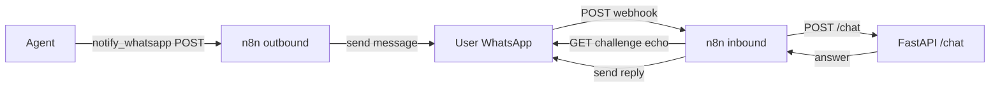

# LexBot

Legal assistant with RAG and agentic AI — a portfolio project for a legal-firm internship.

LexBot ingests a firm's knowledge base (policies, FAQs, contract glossaries), answers legal questions grounded in those documents, searches case records, and registers follow-ups. The project is built incrementally: **Milestone 1** delivered the ingestion pipeline, **Milestone 2** adds the conversational agent and API, **Milestone 3** adds the React chat UI, **Milestone 4** bridges the agent to WhatsApp through n8n; later milestones add production deployment.

> [!NOTE]
> Current status: **Milestones 1–4 complete** — ingestion pipeline (chunk → embed → ChromaDB), LangGraph agent with 4 tools, FastAPI surface, PostgreSQL schema, React 18 chat UI (Vite + Tailwind), and an n8n WhatsApp bridge (outbound notify + inbound receive with Meta webhook verification). 79 passing tests (13 ingest, 26 agent, 10 api, 30 ui).

## Features

- **Text chunking** — deterministic overlapping character windows (`Chunk` + `chunk_text()`)
- **Embedder abstraction** — pluggable providers (OpenAI, Gemini, Fake) behind a single `Embedder` ABC, with a keyless dev fallback
- **Vector store** — ChromaDB persistent wrapper with cosine similarity (`add` / `query` / `count` / `reset`)
- **Ingestion CLI** — `python -m lexbot_ingest.cli` wires chunking → embedding → storage end to end
- **LangGraph agent** — intent classification, tool dispatch, and answer composition with source citations
- **4 agent tools** — `retrieve_knowledge` (ChromaDB), `search_case` (PostgreSQL), `register_follow_up` (PostgreSQL), `notify_whatsapp` (webhook stub)
- **FastAPI surface** — `POST /chat`, `POST /ingest`, `GET /health`
- **n8n WhatsApp bridge** — outbound webhook sends agent `notify_whatsapp` calls to Meta; inbound webhook verifies Meta's challenge and routes messages through `POST /chat`
- **Hermetic tests** — Fake embedder + scripted FakeLLM keep the suite offline and deterministic

## Architecture

```
POST /chat {message}
  → agent: classify_intent (LLM tool selection)
      → tools (ToolNode)
          retrieve_knowledge → ChromaDB (data/chroma, "legal_kb")
          search_case / register_follow_up → PostgreSQL (cases, follow_ups)
          notify_whatsapp → webhook stub
      → compose_answer → {answer, sources, actions}
```

End-to-end architecture:

```
ingest/ → agent/ → api/ → ui/ → n8n/ → db/ → infra/
```

## Repository layout

| Path | Description |
|---|---|
| `ingest/` | Python package: chunker, embeddings, vector store, CLI |
| `agent/` | LangGraph agent: state, LLM factory, tools, graph |
| `api/` | FastAPI app: routers (chat, ingest, health), schemas, Dockerfile |
| `ui/` | React 18 chat UI: Vite + TypeScript + Tailwind CSS, typed API client, vitest tests |
| `db/` | Idempotent PostgreSQL schema (`cases`, `follow_ups`) |
| `docs/knowledge/` | Seed knowledge documents (policies, FAQ, glossary) |
| `docs/superpowers/` | Design spec and Milestone 1 implementation plan |
| `n8n/` | WhatsApp bridge workflow exports (outbound + inbound), re-importable |
| `scripts/demo-whatsapp.sh` | One-shot demo: brings the stack up and sends a real WhatsApp message |
| `docker-compose.yml` | PostgreSQL (pgvector) + API + n8n services |
| `.env.example` | Environment template (providers, API keys, database, WhatsApp) |

## Getting started

### Prerequisites

- Python 3.11+
- Docker (for the API + PostgreSQL stack)
- (Optional) API keys for real LLM/embedding providers — OpenAI or Gemini

### 1. Ingestion pipeline (CLI)

```bash
cd ingest
python -m venv .venv && source .venv/bin/activate
pip install -e ".[dev]"
cp ../.env.example ../.env   # add your API keys
python -m lexbot_ingest.cli --docs ../docs/knowledge --db-path ../data/chroma --provider fake --reset
```

> [!TIP]
> Without API keys, `build_embedder()` falls back to the Fake embedder with a warning — the pipeline runs fully offline for development.

### 2. Agent + API (Docker)

```bash
docker compose up -d --build
curl localhost:8000/health
```

Then chat with the agent:

```bash
curl -X POST localhost:8000/chat \
  -H "Content-Type: application/json" \
  -d '{"message": "What are the confidentiality rules?"}'
```

The API auto-seeds the knowledge base on first start. Without LLM keys it boots with a deterministic fake path; add `GEMINI_API_KEY` (or `OPENAI_API_KEY` + `LLM_PROVIDER=openai`) to `.env` for real answers.

### 3. Web UI (development)

The chat UI lives in `ui/` (React 18 + Vite + Tailwind CSS, TypeScript). It calls the API at `http://localhost:8000` by default.

**Prerequisites:** Node.js `^20.19.0 || >=22.12.0` (Vite 8 engine floor).

Run the API and the UI in two terminals:

```bash
# terminal 1 — API + PostgreSQL
docker compose up -d --build

# terminal 2 — Vite dev server
cd ui && npm install && npm run dev
```

Open http://localhost:5173 — the UI sends requests to `VITE_API_URL` (default `http://localhost:8000`).

| Variable | Where to set it | Default | Purpose |
|---|---|---|---|
| `VITE_API_URL` | `ui/.env.local` (template: `ui/.env.example`) | `http://localhost:8000` | Base URL the UI calls for the LexBot API |
| `CORS_ORIGINS` | repo-root `.env` (template: `.env.example`) | `http://localhost:5173` | Comma-separated browser origins the API allows |

> [!NOTE]
> Vite only reads env files from the Vite project root, so `ui/.env.example` is the operative template for UI settings — copy it to `ui/.env.local` and set `VITE_API_URL` there. The repo-root `.env.example` entry exists for discoverability only.

Tests and build:

```bash
cd ui && npm test       # vitest — 30 tests
cd ui && npm run build  # tsc -b + vite build
```

### 4. WhatsApp bridge (n8n)

n8n is a pure bridge between the Meta WhatsApp Cloud API and LexBot's existing contracts: the agent's `notify_whatsapp` tool POSTs `{phone, message}` to the n8n outbound webhook, and the inbound webhook receives WhatsApp messages and routes them through `POST /chat`. No agent/API code changes were needed.



#### Env vars

| Variable | Where to set it | Empty behavior |
|---|---|---|
| `WHATSAPP_TOKEN` | repo-root `.env` (template: `.env.example`) | Meta send returns 400 (execution error, visible in the n8n UI) |
| `WHATSAPP_PHONE_NUMBER_ID` | repo-root `.env` | Same |
| `WHATSAPP_VERIFY_TOKEN` | repo-root `.env` | Meta webhook verification challenge is rejected |
| `N8N_WEBHOOK_URL` | repo-root `.env` | `notify_whatsapp` returns `{"status":"stub"}` (no real send) |

`N8N_WEBHOOK_URL` takes one of two values depending on the caller:

- api container (in-network): `http://n8n:5678/webhook/outbound-whatsapp`
- host runs (scripts/tests): `http://localhost:5679/webhook/outbound-whatsapp`

> [!NOTE]
> Port **5679** is the host port for n8n (container 5678) — 5678 stays free for other n8n instances. The workflows read Meta credentials only via `{{ $env.WHATSAPP_* }}`; no credential UI configuration is needed.

#### Start + import workflows

```bash
docker compose up -d            # starts db, api, n8n (healthcheck on :5679/healthz)
docker compose exec n8n n8n import:workflow --separate --input=/home/node/workflows/
docker compose restart n8n      # re-register webhooks from the imported workflow state
```

The imports live in `n8n/` (`outbound-whatsapp.json`, `inbound-whatsapp.json`) and mount read-only at `/home/node/workflows`.

#### Verify the bridge without Meta

```bash
# outbound: webhook answers 200 {"status":"sent"} immediately
curl -X POST localhost:5679/webhook/outbound-whatsapp \
  -H "Content-Type: application/json" \
  -d '{"phone":"+1234567890","message":"hi"}'

# inbound: Meta verification handshake echoes the challenge only for a valid token
curl "localhost:5679/webhook/inbound-whatsapp?hub.mode=subscribe&hub.verify_token=$WHATSAPP_VERIFY_TOKEN&hub.challenge=12345"
```

`scripts/demo-whatsapp.sh` automates the full stack bring-up and a real outbound send once `WHATSAPP_*` credentials are set.

### Run the tests

```bash
cd ingest && python -m pytest tests/ -v    # 13 tests
cd agent  && python -m pytest tests/ -v    # 26 tests
cd api    && python -m pytest tests/ -v    # 10 tests
```

## Technology stack

| Component | Technology |
|---|---|
| Language | Python 3.11+ |
| Agent framework | LangGraph ≥ 0.2, langchain-core ≥ 0.3 |
| LLMs | Google Gemini (`gemini-embedding-001`, `gemini-2.0-flash`), OpenAI (`text-embedding-3-small`) |
| Embeddings | OpenAI, Google Gemini, built-in Fake |
| Vector store | ChromaDB ≥ 0.5 (persistent client, cosine) |
| API | FastAPI, uvicorn, pydantic |
| Database | PostgreSQL 15 + pgvector (Docker Compose), psycopg 3 |
| CLI | argparse |
| Tests | pytest |
| Frontend | React 18 + Vite + Tailwind CSS |
| Orchestration | n8n (WhatsApp bridge), AWS CDK (planned) |

## Roadmap

- [x] **Milestone 1** — Scaffold + ingestion pipeline
- [x] **Milestone 2** — Agent + API (LangGraph, FastAPI)
- [x] **Milestone 3** — Web UI (React 18 + Vite)
- [x] **Milestone 4** — n8n + WhatsApp integration
- [ ] **Milestone 5** — Production deployment (AWS CDK)

## Documentation

- [Design spec](docs/superpowers/specs/2026-08-24-lexbot-design.md)
- [Milestone 1 implementation plan](docs/superpowers/plans/2026-08-24-lexbot-milestone1-scaffold-ingestion.md)