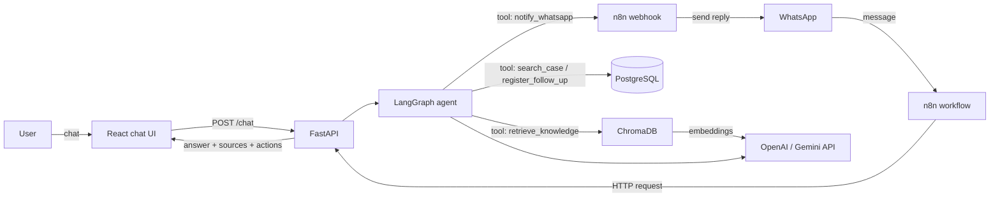
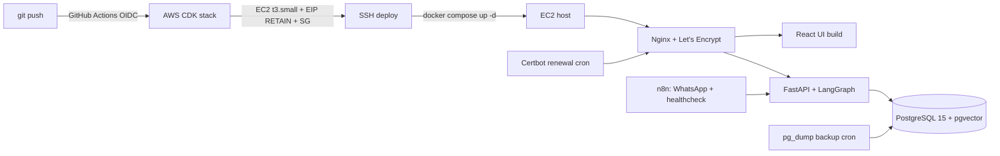

# LexBot — Legal Assistant with RAG and Agentic AI

**Date:** 2026-08-24
**Status:** Approved design + production deployment (Option A: EC2 + Docker Compose)
**Target:** Portfolio project for a legal-firm internship (AI bots, agents, automation)

---

## Purpose

LexBot is an AI agent that answers questions about a law firm's internal knowledge
(contracts, policies, FAQs) and executes real actions through tool calling: querying a
PostgreSQL case database, registering follow-ups, and notifying contacts via WhatsApp
(through n8n). It is exposed through a web chat UI and a WhatsApp channel, and is
**deployed to production on AWS** with a real CI/CD pipeline.

The project maps 1:1 to the internship vacancy requirements: OpenAI/Gemini API usage,
agents with tool/function calling, RAG over a knowledge base, n8n, WhatsApp
integrations, SQL/vector databases, Python + JavaScript, Git/GitHub.

## Goals and success criteria

1. Answer questions from the knowledge base with **citations to source documents**.
2. Execute at least 3 tools: `retrieve_knowledge` (RAG), `search_case` (SQL),
   `register_follow_up` (SQL insert), `notify_whatsapp` (n8n webhook).
3. Two channels: web chat UI (React) and WhatsApp (n8n → FastAPI).
4. Repo quality: README with Mermaid architecture, pytest suite, Docker Compose local stack.
5. A 2-minute demo script covering a knowledge question, a case query, and an action.
6. **Production deployment** on AWS EC2 (t3.small) with GitHub Actions OIDC → CDK → SSH →
   Docker Compose, Nginx + Let's Encrypt SSL, pgvector, backups, and monitoring.

## Non-goals (YAGNI)

- No authentication, multi-tenancy, or user management.
- No streaming responses.
- No document-upload UI: ingestion is a CLI script over a `docs/` folder.
- No autoscaling, load balancer, or multi-AZ: a single EC2 instance is deliberate
  (demo + small-firm scale; documented tradeoff, ~$15/mo).
- No managed WhatsApp number approval for the demo: Meta test number covers it; the
  approval path is documented as the follow-up.
- No eval harness beyond the scripted demo scenarios.

## Architecture (local)

## Architecture (production — Option A)

- Same proven pipeline as `n8n-ops-hub`: GitHub Actions OIDC (no static credentials) →
  CDK (VPC, EC2, EIP with RETAIN, security groups) → SSH → `docker compose up -d`.
- Nginx serves the React static build and reverse-proxies the API; Certbot handles SSL.
- **pgvector replaces ChromaDB in production**: one database for transactional data and
  embeddings; unified backups. ChromaDB stays for local dev.
- n8n runs inside the stack (WhatsApp bridge + bot health alerts), reusing the
  n8n-ops-hub operational pattern.

## Components

| Component | Responsibility | Tech |
|---|---|---|
| `ingest/` | Chunk legal docs, embed, store in vector DB | Python, ChromaDB (dev) / pgvector (prod), OpenAI/Gemini embeddings |
| `agent/` | Orchestrate intent → retrieval → tool calls → answer | Python, LangGraph, LLM (gpt-4o-mini or Gemini, env-configurable) |
| `api/` | HTTP surface for chat and ingestion | FastAPI: `POST /chat`, `POST /ingest`, `GET /health` |
| `ui/` | Chat interface | React 18 + Vite + Tailwind (pattern from `frecuencia-colectiva`) |
| `n8n/` | WhatsApp bridge + notification webhook | n8n workflow JSON exports, Meta Cloud API (test number) |
| `db/` | Case, follow-up, and embedding data | PostgreSQL 15 + pgvector (Docker) |
| `infra/` | Local orchestration + production stack | docker-compose.yml, .env.example, AWS CDK (TypeScript, n8n-ops-hub pattern) |

## Data flow (happy path)

1. User sends a message from the web UI or WhatsApp.
2. `POST /chat` reaches the LangGraph agent.
3. The agent classifies intent and calls `retrieve_knowledge` when the question needs internal knowledge; retrieved chunks are injected as context.
4. When the request implies data or an action, the agent calls the corresponding SQL/n8n tool.
5. The agent composes the final answer **with source citations** and returns
   `{answer, sources, actions}`.
6. WhatsApp path: n8n receives the message, calls `/chat`, and sends the reply back.

## Tool-calling contract

- Tools are declared with JSON schemas and executed through LangGraph's `ToolNode`.
- Each tool returns structured JSON (never free text).
- The agent is instructed to cite source documents in the answer when retrieval was used.
- Tool failures return a structured error the agent can surface gracefully.

## Error handling

| Failure | Behavior |
|---|---|
| Retrieval returns nothing | Agent states it lacks the information and offers to notify a human (`notify_whatsapp`) |
| LLM/API failure | HTTP 503 with a retry hint; n8n workflow has an error branch |
| DB unavailable | Tool returns error JSON; agent answers gracefully without crashing |
| Missing ChromaDB collection (dev) | Auto-ingest seed documents on first run |
| Deploy fails mid-pipeline | Pipeline stops before `compose up`; previous container set stays up (two-phase deploy) |

## Testing strategy

- **Unit:** chunker behavior; each tool against a test PostgreSQL database; agent graph with a mocked LLM.
- **Integration:** `docker compose up` → ingest seed docs → scripted `/chat` calls end-to-end.
- **Manual demo:** five scripted questions: knowledge question (with citation), case query, follow-up registration, out-of-scope question (graceful decline), WhatsApp path.
- **Post-deploy smoke test:** GitHub Actions runs `GET /health` + one scripted `/chat` call against the production URL after deploy.

## Tech decisions

| Decision | Choice | Rationale / alternatives |
|---|---|---|
| Agent framework | LangGraph | Explicit tool-calling control; industry-relevant. CrewAI (less control) or LCEL (dated) rejected |
| Vector store (dev) | ChromaDB embedded | Zero extra infra for local work |
| Vector store (prod) | pgvector | One DB for transactional + embeddings; unified backups. ChromaDB stays dev-only |
| LLM | Gemini (free tier) or gpt-4o-mini | Env-configurable; Gemini first to keep cost ~$0 |
| Backend | FastAPI | Standard, async-friendly |
| Frontend | React + Vite + Tailwind | Reuses existing skill from `frecuencia-colectiva` |
| WhatsApp | n8n + Meta Cloud API test number | n8n is already a proven skill (n8n-ops-hub); test number is free |
| Deployment | EC2 t3.small + Docker Compose | Proven n8n-ops-hub pattern; ~$15/mo. Fargate rejected for cost/complexity at this scale |
| CI/CD | GitHub Actions + OIDC | No static AWS credentials; same pipeline as n8n-ops-hub |
| Domain | sslip.io (free) or own domain ~$10/yr | Own domain looks better for a law-firm-facing demo |
| Secrets | GitHub Actions secrets / .env | Never committed; injected at deploy time |

## Milestones

1. **Scaffold + ingestion** — repo, docker-compose, docs folder, ChromaDB pipeline (week 1)
2. **Agent + API** — LangGraph graph with 4 tools, FastAPI endpoints, unit tests (week 2)
3. **Chat UI** — React chat, wire to `/chat` (week 3)
4. **n8n + polish** — WhatsApp workflow, README + Mermaid, demo script, full test pass (week 4)
5. **Production** — CDK stack, GitHub Actions OIDC pipeline, Nginx + Let's Encrypt,
   pgvector migration, backups cron, healthcheck monitoring, post-deploy smoke test (week 5)

## Risks

- **WhatsApp testing:** Meta dev-mode test number covers testing; fallback is simulating the webhook. Production approval is a multi-day process, documented as follow-up.
- **API cost:** mitigated with Gemini free tier; budgets under ~$5 USD if using OpenAI. Production demo traffic is negligible.
- **Ongoing infra cost:** ~$15/mo sustained while the demo is live; can be stopped when not needed.
- **Scope creep:** UI stays minimal (no auth, no streaming); guardrails in non-goals.
- **Gemini free-tier rate limits:** acceptable for demo traffic; OpenAI key is the documented fallback.